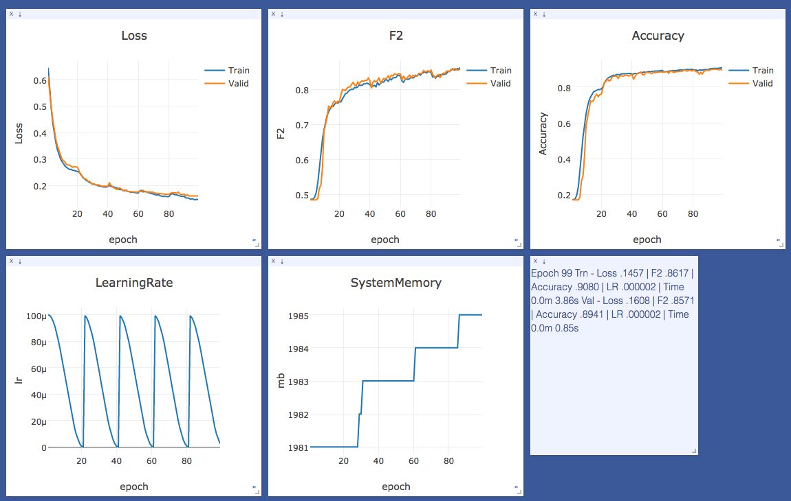
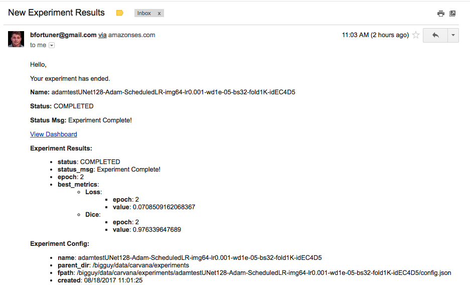

## Summary
Pytorch Kaggle starter is a framework for managing experiments in Kaggle competitions. It reduces time to first submission by providing a suite of helper functions for model training, data loading, adjusting learning rates, making predictions, ensembling models, and formatting submissions. 

Inside are example Jupyter notebooks walking through how to get strong scores on popular competitions:

* [Dogs vs Cats Redux](https://www.kaggle.com/c/dogs-vs-cats-redux-kernels-edition) - Top 8%
* [Planet Amazon Rainforest](https://www.kaggle.com/c/planet-understanding-the-amazon-from-space) - Top 15%
* [Carvana Image Segmentation](https://www.kaggle.com/c/carvana-image-masking-challenge) - WIP

These notebooks outline basic, single-model submissions. Scores can be improved significantly by ensembling different models and using test-time augmentation.

## Features

1. **Experiments** - Launch experiments from python dictionaries inside jupyter notebooks or python scripts. Attach Visualizers (Visdom, Kibana), Metrics (Accuracy, F2, Loss), or external datastores (S3, Elasticsearch)
2. **Monitoring** - Track experiments from your phone or web-browser in real-time with Visdom, a lightweight visualization framework from Facebook
3. **Notifications** - Receive email notifications when experiments complete or fail
4. **Sharing** - Upload experiments, predictions and ensembles to S3 for other users to download
5. **Analysis** - Compare experiments across users with Kibana. Design custom dashboards for specific competitions
6. **Helpers** - Reduce time to submission with helper code for common tasks--custom datasets, metrics, storing predictions, ensembling models, making submissions, and more.
7. **Torchsample** - Includes the latest release of ncullen93's [torchsample](https://github.com/ncullen93/torchsample) project for additional trainer helpers and data augmentations.

## Requirements

1. [Anaconda](https://www.continuum.io/downloads) with Python3
2. [Pytorch](http://pytorch.org/)
3. Other requirements: ```pip install -r requirements.txt```
4. conda install -c menpo opencv
5. Server with GPU and Cuda installed

## Datasets
To get started you'll need to move all training and test images to the `project_root/datasets/inputs` directory (then either trn_jpg tst_jpg subdirectories). Running the first cell of each notebook creates the directory structure outlined in the `config.py` file.

There is no need to create separate directories for classes or validation sets. This is handled by the data_fold.py module and the FileDataset, which expects a list of filepaths and targets. After trying out a lot of approaches, I found this to be the easiest and most extensible. You'll sometimes need to generate a `metadata.csv` file separately if Kaggle didn't provide one. This sort of competition-specific code can live in the `competitions/` directory.

## Visdom
Visualize experiment progress on your phone with Facebook's new [Visdom](https://github.com/facebookresearch/visdom) framework.



## Kibana
Spin up an [Elasticsearch](https://www.elastic.co/) cluster locally or on AWS to start visualizing or tracking experiments. Create custom dashboards with [Kibana's](https://www.elastic.co/products/kibana) easy-to-use drag and drop chart creation tools.


Filter and sort experiments, zoom to a specific time period, or aggregate metrics across experiments and see updates in real time.


## Emails
Receive emails when experiments compete or fail using AWS SES service.



## Kaggle CLI
Quickly download and submit with the kaggle cli tool.

```
kg download -c dogs-vs-cats-redux-kernels-edition -v -u USERNAME -p PASSWORD
kg submit -m 'my sub' -c dogs-vs-cats-redux-kernels-edition -v -u USERNAME -p PASSWORD my_exp_tst.csv
```

## Best practices

* Use systemd for always running Visdom and Jupyter servers


## Unit Tests

Run tests with:
```
python -m pytest tests/
```

Other run commands:
```
python -m pytest tests/ (all tests)
python -m pytest -k filenamekeyword (tests matching keyword)
python -m pytest tests/utils/test_sample.py (single test file)
python -m pytest tests/utils/test_sample.py::test_answer_correct (single test method)
python -m pytest --resultlog=testlog.log tests/ (log output to file)
python -m pytest -s tests/ (print output to console)
```

## TODO

* Add TTA (test time augmentation) example
* Add Pseudolabeling example
* Add Knowledge Distillation example
* Add Multi-input/Multi-target examples
* Add stacking helper functions
